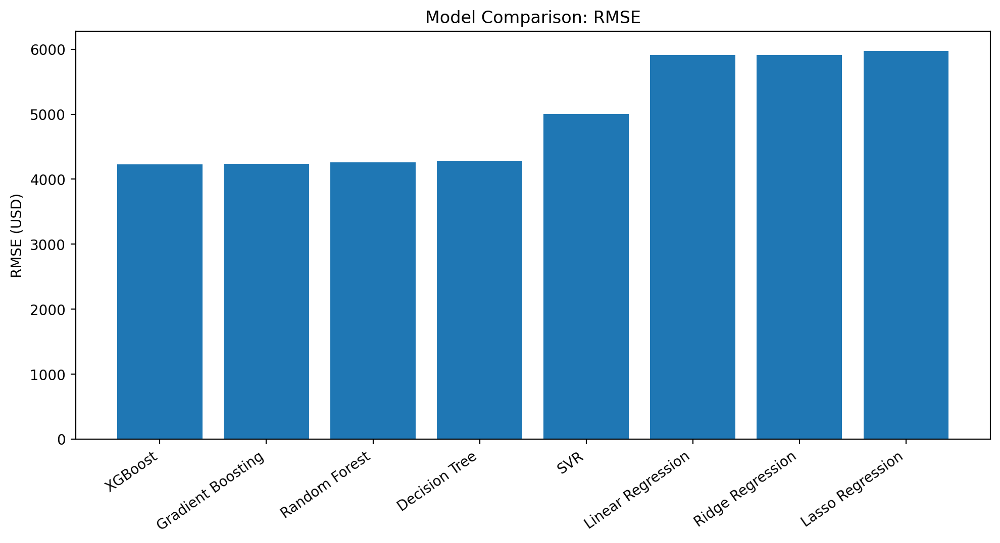
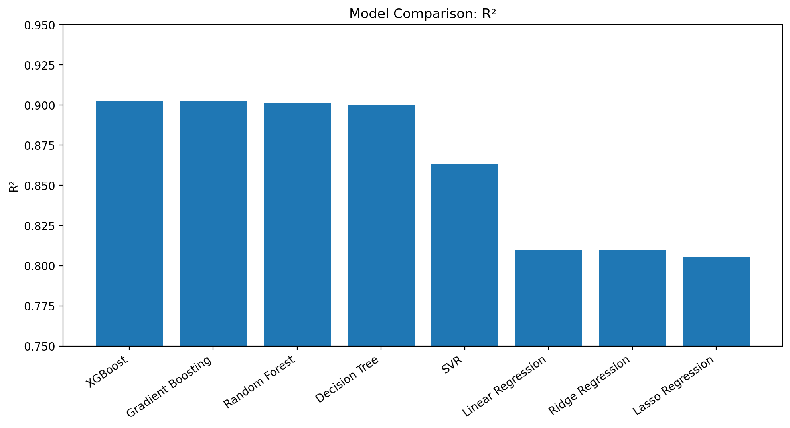
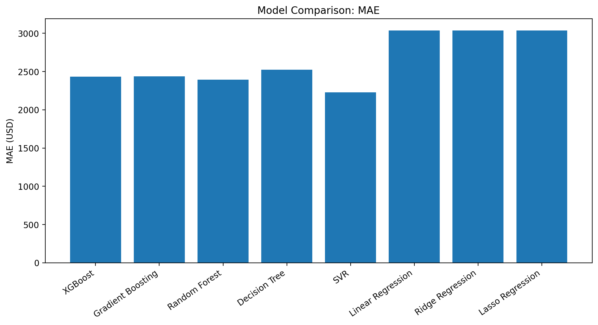
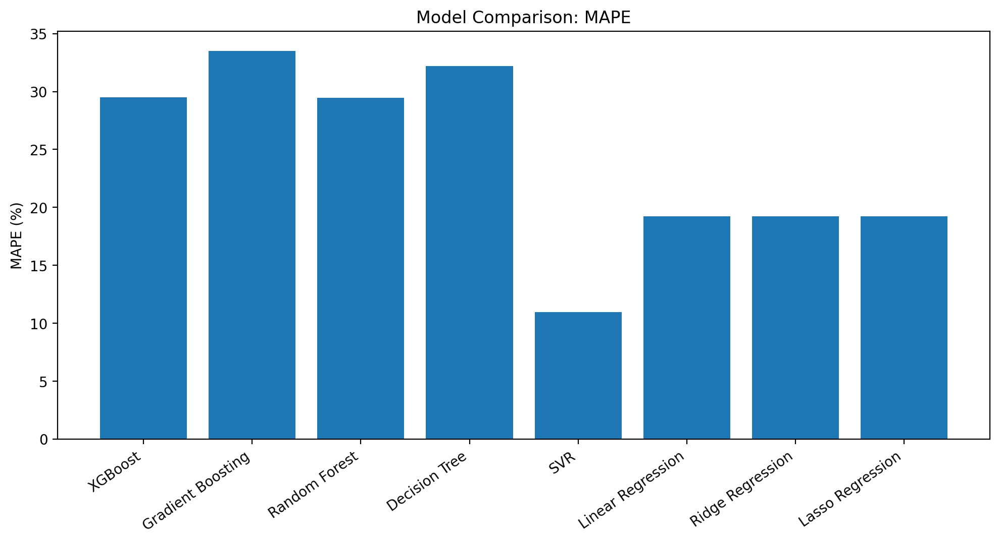

## 📌 Project-1 Overview


# ❤️ Heart Disease Prediction

A Data Science and Machine Learning project focused on analyzing patient health data and predicting the presence of heart disease.

## 📌 Project Overview

Heart disease is one of the major health problems worldwide. Early identification of patients who may be at risk can help support better medical decision-making.

In this project, we explore a heart disease dataset, perform data preprocessing and exploratory data analysis (EDA), visualize important relationships between features, and build machine learning models to predict whether a patient is likely to have heart disease.

The complete analysis and implementation are available in the Jupyter Notebook:

`heartdiseaseproject.ipynb`

---

## 🎯 Objectives

The main objectives of this project are:

- Understand the heart disease dataset
- Perform data cleaning and preprocessing
- Analyze important patient characteristics
- Perform Exploratory Data Analysis (EDA)
- Visualize relationships between variables
- Identify important features related to heart disease
- Train machine learning classification models
- Evaluate model performance
- Predict the presence of heart disease

---

## 📊 Dataset

The dataset contains patient-related medical and demographic information that can be used to predict heart disease.

Typical features include:

| Feature | Description |
|---|---|
| Age | Age of the patient |
| Sex | Gender of the patient |
| Chest Pain | Type of chest pain experienced |
| Resting Blood Pressure | Resting blood pressure |
| Cholesterol | Serum cholesterol level |
| Fasting Blood Sugar | Fasting blood sugar level |
| Resting ECG | Resting electrocardiographic results |
| Maximum Heart Rate | Maximum heart rate achieved |
| Exercise Angina | Exercise-induced angina |
| ST Depression | ST depression induced by exercise |
| ST Slope | Slope of the peak exercise ST segment |
| Heart Disease | Target variable indicating presence/absence of heart disease |

> **Note:** The exact features depend on the dataset used in `heartdiseaseproject.ipynb`.

---

## 🔍 Exploratory Data Analysis

The project performs exploratory analysis to understand the dataset and identify patterns.

Some of the analysis includes:

- Dataset structure and dimensions
- Missing-value analysis
- Statistical summaries
- Distribution of numerical features
- Categorical feature analysis
- Correlation analysis
- Target-variable distribution
- Relationship between patient characteristics and heart disease

Visualizations are used to make the patterns easier to understand.

---

## 🧹 Data Preprocessing

Before training the machine learning models, the data is prepared through appropriate preprocessing steps.

The preprocessing may include:

- Handling missing values
- Removing or handling duplicate records
- Encoding categorical variables
- Feature scaling
- Separating features and target variable
- Splitting the dataset into training and testing sets

---

## 🤖 Machine Learning

This project treats heart disease prediction as a **binary classification problem**.

Machine learning algorithms can be trained to classify patients into two categories:

- `0` → No heart disease
- `1` → Heart disease

Depending on the notebook implementation, classification algorithms may include:

- Logistic Regression
- Decision Tree
- Random Forest
- K-Nearest Neighbors (KNN)
- Support Vector Machine (SVM)

---

## 📈 Model Evaluation

The trained models can be evaluated using several classification metrics:

- Accuracy
- Precision
- Recall
- F1-Score
- Confusion Matrix

---------------------------------------------------------------------------------------------------------------------------------------------------------------------------------------------
# 📌Project 2- overview.

# Title- Medical Cost Prediction Using Machine Learning Regression


Goal- Medical insurance charges vary between individuals based on demographic and lifestyle-related characteristics. This project applies an end-to-end **data science and machine learning regression workflow** to predict individual medical insurance charges.

### Workflow

**Data Collection → Data Cleaning → EDA → Visualization → Feature Engineering → Model Training → Evaluation → Prediction**

---

## Project Overview

Medical insurance charges vary between individuals based on demographic and lifestyle-related characteristics. This project applies an end-to-end **data science and machine learning regression workflow** to predict individual medical insurance charges.


## Project Objectives

- Understand the Medical Cost Personal Dataset
- Inspect and clean the dataset
- Check missing values and duplicate records
- Analyze potential outliers
- Perform Exploratory Data Analysis (EDA)
- Visualize distributions and feature-target relationships
- Create meaningful interaction features
- Encode categorical variables
- Train and compare multiple regression algorithms
- Evaluate models using MAE, RMSE, R², and MAPE
- Select a model based on the defined evaluation criteria
- Generate predictions for unseen test observations
- Analyze prediction errors and residuals

---

## Dataset

**Dataset:** Medical Cost Personal Dataset  
**Target Variable:** `charges`

| Feature | Type | Description |
|---|---|---|
| `age` | Numerical | Age of the individual |
| `sex` | Categorical | Sex of the individual |
| `bmi` | Numerical | Body Mass Index |
| `children` | Numerical | Number of children/dependents |
| `smoker` | Categorical | Smoking status |
| `region` | Categorical | Residential region |
| `charges` | Numerical | Individual medical insurance charge |

### Dataset Summary

- **Original records:** 1,338
- **Columns:** 7
- **Duplicate records identified:** 1
- **Records after duplicate removal:** 1,337
- **Target variable:** `charges`
- **Source:** Medical Cost Personal Dataset (Kaggle)

---

# Exploratory Data Analysis

EDA was performed to understand the dataset before model development.

## Statistical Overview

| Variable | Mean |
|---|---:|
| Age | 39.22 years |
| BMI | 30.66 |
| Children | 1.10 |
| Charges | 13,279.12 USD |

The EDA includes:

- Descriptive statistics using `df.describe()`
- Medical charges distribution
- Log-transformed charges distribution
- Age vs. Charges analysis
- BMI vs. Charges analysis
- Smoker vs. Charges comparison
- Correlation analysis
- Outlier analysis

### EDA Analysis

The target variable `charges` has a wide distribution, indicating substantial variation in individual medical costs.

Smoking status shows a strong relationship with medical charges. Age and BMI were also examined against charges to understand their relationships with the target.

Potential outliers were examined using the IQR method. Extreme medical charges were not automatically removed because they may represent legitimate high-cost insurance cases.

---

# Data Cleaning and Preprocessing

The project performed the following preprocessing steps:

1. Inspected dataset shape, columns, and data types.
2. Checked for missing values.
3. Identified duplicate records.
4. Removed the identified duplicate record.
5. Examined potential outliers using the IQR method.
6. Prepared categorical variables for machine learning.
7. Prepared numerical and engineered features for model development.

---

# Feature Engineering

Interaction features were created to represent combined effects involving smoking status:

```python
df_fe["smoker_bmi"] = df_fe["smoker"] * df_fe["bmi"]
df_fe["smoker_age"] = df_fe["smoker"] * df_fe["age"]
```

These features allow the models to represent interactions between smoking status and BMI or age.

Categorical variables were encoded into numerical representations so that they could be used by the regression algorithms.

---

# Feature Analysis

Correlation-based analysis was used to examine relationships between predictors and medical charges.

Important relationships identified in the project include:

| Feature | Correlation with Charges |
|---|---:|
| `smoker_yes` | 0.7872 |
| `age` | 0.2983 |
| `bmi_category_Obese` | 0.2003 |
| `bmi` | 0.1984 |

The available predictors were retained for model development rather than performing aggressive feature removal.

---

# Regression Models

Eight regression algorithms were evaluated:

1. **Linear Regression**
2. **Ridge Regression**
3. **Lasso Regression**
4. **Support Vector Regression (SVR)**
5. **Decision Tree Regressor**
6. **Random Forest Regressor**
7. **Gradient Boosting Regressor**
8. **XGBoost Regressor**

The models were evaluated using the same held-out test data.

---

# Evaluation Metrics

### MAE — Mean Absolute Error

Measures the average absolute difference between actual and predicted charges.

**Lower is better.**

### RMSE — Root Mean Squared Error

Measures prediction error while giving greater weight to larger errors.

**Lower is better.**

### R² — Coefficient of Determination

Measures the proportion of variation in medical charges explained by the model.

**Higher is better.**

### MAPE — Mean Absolute Percentage Error

Measures the average prediction error as a percentage.

**Lower is better.**

---

# Model Performance Comparison

The following results are from the current test-set comparison.

| Model | RMSE ↓ | MAE ↓ | R² ↑ | MAPE ↓ |
|---|---:|---:|---:|---:|
| **XGBoost** | **4232.02** | 2433.53 | **0.9025** | 29.51% |
| Gradient Boosting | 4234.68 | 2435.75 | 0.9024 | 33.53% |
| Random Forest | 4257.38 | **2394.85** | 0.9014 | 29.44% |
| Decision Tree | 4282.17 | 2525.35 | 0.9002 | 32.19% |
| Support Vector Regression | 5008.51 | **2226.32** | 0.8635 | **10.97%** |
| Linear Regression | 5913.46 | 3038.36 | 0.8097 | 19.21% |
| Ridge Regression | 5915.70 | 3038.61 | 0.8096 | 19.21% |
| Lasso Regression | 5978.81 | 3035.37 | 0.8055 | 19.23% |

## Model Comparison Graphs

### RMSE Comparison



**Interpretation:** Lower RMSE indicates smaller prediction error, with larger errors receiving greater penalty. XGBoost has the lowest RMSE in the current comparison at **4232.02**.

### R² Comparison



**Interpretation:** Higher R² indicates that the model explains a larger proportion of the variation in medical charges. XGBoost has the highest R² at **0.9025**.

### MAE Comparison



**Interpretation:** SVR has the lowest MAE at **2226.32**, meaning it has the smallest average absolute error among these models according to this metric.

### MAPE Comparison



**Interpretation:** SVR has the lowest MAPE at **10.97%** in this comparison.

---

# Best Model Result

## XGBoost Regressor

Using **RMSE and R² as the primary model-selection criteria**, XGBoost produced the strongest result in the current comparison.

### XGBoost Performance

| Metric | Result |
|---|---:|
| **RMSE** | **4232.02** |
| **MAE** | **2433.53** |
| **R²** | **0.9025** |
| **MAPE** | **29.51%** |

### Why XGBoost is selected

- It has the **lowest RMSE**: 4232.02
- It has the **highest R²**: 0.9025
- It performs strongly compared with the other nonlinear and ensemble models

The metrics do not all identify the same model. **SVR has the lowest MAE and MAPE**, while **XGBoost has the lowest RMSE and highest R²**. Therefore, the final model selection in this project is based specifically on **RMSE and R²**.

---

# Results and Analysis

The current model comparison shows a clear difference between basic linear models and nonlinear/ensemble approaches.

### Linear Models

Linear Regression, Ridge, and Lasso produced R² values around **0.81**, indicating that the basic linear approaches explain less of the variation in medical charges than the strongest nonlinear models in this experiment.

### Tree-Based and Ensemble Models

Decision Tree, Random Forest, Gradient Boosting, and XGBoost achieved R² values around **0.90**. Their RMSE values were also substantially lower than those of the basic linear models.

### Support Vector Regression

SVR produced:

- **MAE = 2226.32**
- **MAPE = 10.97%**
- **RMSE = 5008.51**
- **R² = 0.8635**

This shows why it is important to evaluate a regression model with multiple metrics. SVR performs strongly according to MAE and MAPE, but it does not have the lowest RMSE or highest R² in the current comparison.

### Overall Analysis

The results indicate that the relationships between the available features and medical charges are not adequately represented by a simple linear relationship alone. Nonlinear and ensemble models capture more of the variation in the target in this test-set comparison.

---

# Prediction and Error Analysis

The project generates predictions for held-out test observations and analyzes:

- Actual vs. predicted medical charges
- Residuals
- Absolute prediction errors
- Model performance on unseen test observations

The analysis indicates that absolute prediction errors tend to become larger for the highest-cost individuals.

---

# Project Structure

```text
medical-cost-prediction/
├── README.md
├── Medical_Cost_Regression_Notebook.ipynb
├── insurance.csv
├── figures/
│   ├── rmse_comparison.png
│   ├── r2_comparison.png
│   ├── mae_comparison.png
│   ├── mape_comparison.png
│   ├── target_distribution.png
│   ├── model_comparison.png
│   └── actual_vs_predicted.png
└── outputs/
    ├── medical_cost_predictions.csv
    └── medical_cost_processed_dataset.csv
```

> **Note:** The four model-comparison images above are generated from the current results table. The `actual_vs_predicted.png` image should be the actual plot generated by the notebook, not a fabricated replacement.

---

# Technologies

- Python
- Google Colab / Jupyter Notebook
- Pandas
- NumPy
- Matplotlib
- Seaborn
- Scikit-learn
- XGBoost

---

# How to Run

### 1. Clone the repository

```bash
git clone <YOUR-GITHUB-REPOSITORY-URL>
cd medical-cost-prediction
```

### 2. Open the notebook

Open:

```text
Medical_Cost_Regression_Notebook.ipynb
```

in **Google Colab** or **Jupyter Notebook**.

### 3. Install XGBoost if required

```python
!pip install xgboost
```

### 4. Load the dataset

```python
import pandas as pd

df = pd.read_csv("insurance.csv")
```

### 5. Run the notebook

Run the notebook from top to bottom to reproduce:

**Data Preparation → EDA → Feature Engineering → Model Training → Evaluation → Model Comparison → Prediction Analysis**

---

# Limitations

- The dataset contains a limited number of predictors.
- Medical charges can depend on factors not represented in the dataset.
- The data is observational, so relationships should not be interpreted as causal.
- Model performance depends on the available sample and train-test split.
- The dataset may not represent every population or healthcare system.

---

# Future Work

- Systematic hyperparameter tuning
- Grid Search or Randomized Search
- Repeated cross-validation
- Additional regression and ensemble algorithms
- Larger and more diverse datasets
- Additional healthcare and socioeconomic variables
- Explainable AI using SHAP or LIME
- More detailed residual and error analysis

---

# Academic Context

**Course:** Introduction to Data Science Lab  
**Course Code:** CSE 4114  
**Project Type:** Regression  
**Dataset:** Medical Cost Personal Dataset  
**Target Variable:** `charges`

---

# Authors

**MD. NASIRUDDIN SHAEL**  
Department of Computer Science and Engineering, NUBTK

**MD. ABUBAKAR SIAM**  
Department of Computer Science and Engineering, NUBTK

---

## License

This project is intended for academic and educational purposes.


